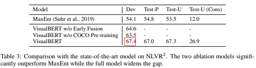
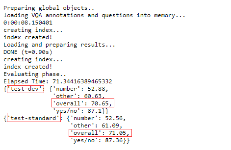
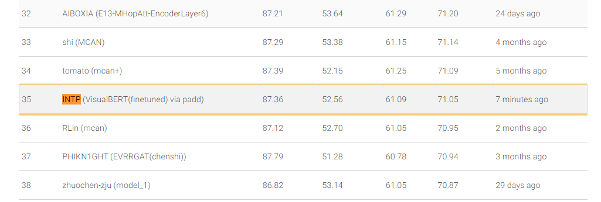

# 使用 Paddle 复现论文 VisualBERT: A Simple and Performant Baseline for Vision and Language

竞赛详情页：https://aistudio.baidu.com/aistudio/competition/detail/106

## VisualBERT

[VisualBERT: A Simple and Performant Baseline for Vision and Language](https://arxiv.org/pdf/1908.03557.pdf)

多模态预训练 + 子任务微调

用于image caption预训练的两大目标：
1. 模型根据现有文字和图片，预测masked文字
2. 模型指示文字和图片是否匹配

端：masked句子 concate det_cropped_objs
到：transformer
端：完型填空答案 + 指示词语和图片关联

1. 结构化知识：img + caption ==> dets(检测知识) + words(语言知识)
2. 学习目标：前述两种 pretext task
3. 学习主体：多层多头transformer
4. 迁移任务：视觉问答、视觉推理


**原论文测试集效果：**

VQA数据集2017 visual question answering


NLVR数据集2019 natural language for visual reasoning



## VQA2 验证集精度复现效果

用于做下游任务finetune过程对齐，不在验收标准内

| 验证集 | minival | 
| -----  | -------- |
| 原模型 |   0.82541   |
| Paddle复现 |  0.82034  |

论文中未公布验证集精度，使用`uclanlp/visualbert-vqa`在验证集上测试 `acc=0.82697`，[测试log](https://github.com/chenkangyang/visualbert/blob/kk/logs/vqa_finetune/run_0.log)

1. 使用原仓库代码和配置文件，从`uclanlp/visualbert-vqa-pre`finetune 10个epoch，`acc=0.82541`，单卡3090，显存20G，[原始代码finetune日志](https://github.com/chenkangyang/visualbert/blob/kk/logs/vqa_finetune_0926/run_0.log)
> Val epoch 8 has acc 0.82541 and loss 1.65776

2. 使用paddle复现，并从`paddle_visualbert/visualbert-vqa-pre` **finetune** 10个epoch，`acc=0.8203476`, 单卡1080Ti，显存12G
> eval loss: 1.681629, acc: [0.8203476]
运行以下脚本
```bash
sh vqa-finetune.sh
```

单卡 1080Ti，训练10个epoch，完整结果见网盘：
> 链接：https://pan.baidu.com/s/1Cci0wLT_roayj2e1KkmZvw 
提取码：m973 
--来自百度网盘超级会员V5的分享

## Paddle VQA2 测试集结果 For 验收

| 测试集 | Test-Dev | Test-Std |
| -----  | -------- | -------- |
| 原模型 |   70.81   |  71.01  |
| Paddle复现 |  70.65  |  71.05  |


选择**finetune**过程中表现较好的模型`vqa2_ft_model_102830.pdparams`(可在上述网盘链接中下载)，运行以下脚本生成`result.json`，提交到竞赛网站

```bash
cd VQA2
CUDA_VISIBLE_DEVICES=0 python run_predict.py --model_name_or_path ../logs/vqa/vqa2_ft_model_102830.pdparams
```

> `result.json`
链接：https://pan.baidu.com/s/14w-FUuTVouq-kdBO-DooAw 
提取码：urwt 
--来自百度网盘超级会员V5的分享

**finetune** 配置如下：
```
-----------  Configuration Arguments -----------
adam_epsilon: 1e-06
batch_size: 64
bert_model_name: bert-base-uncased
device: gpu
input_dir: ./X_COCO/
learning_rate: 2e-05
logging_steps: 100
max_seq_length: 128
max_steps: -1
model_name_or_path: checkpoint/paddle_visualbert/visualbert-vqa-pre
model_type: visualbert
num_train_epochs: 10
output_dir: ./logs/vqa
save_steps: 10000
scale_loss: 32768
seed: 42
task_name: vqa2
use_amp: False
warmup_proportion: 0.1
warmup_steps: 0
weight_decay: 0.0
```

### （1）Paddle VQA2 Test-Dev 复现效果

提交`result.json`到评测系统 [VQA Chanllenge 2021](https://eval.ai/web/challenges/challenge-page/830/)


Test-Dev 数据集测评结果 Sdtout file：复现 Overall 精度达到 `70.65`


Test-Dev 三个结果文件对应链接: [Submitted file](https://evalai.s3.amazonaws.com/media/submission_files/submission_158590/7c161873-8a7d-499e-8870-5886cf5caf02.json), [Result file](https://evalai.s3.amazonaws.com/media/submission_files/submission_158590/6f8921ed-168f-4e9f-ab75-d986952ff5f6.json), [Stdout file](https://evalai.s3.amazonaws.com/media/submission_files/submission_158590/bb580e05-92ed-4ea5-9a53-13fb9fe7de1b.txt)


检查本地文件和远程文件[Submitted file](https://evalai.s3.amazonaws.com/media/submission_files/submission_158590/7c161873-8a7d-499e-8870-5886cf5caf02.json) md5

```bash
(paddle) ➜  paddle_visual_bert git:(visual_bert_test) ✗ md5sum VQA2/result.json
0a5cb1d54be1c35e8b3d9147dfb7aa85  VQA2/result.json

(paddle) ➜  paddle_visual_bert git:(visual_bert_test) ✗ wget https://evalai.s3.amazonaws.com/media/submission_files/submission_158590/7c161873-8a7d-499e-8870-5886cf5caf02.json
--2021-09-28 10:03:55--  https://evalai.s3.amazonaws.com/media/submission_files/submission_158590/7c161873-8a7d-499e-8870-5886cf5caf02.json
Resolving evalai.s3.amazonaws.com (evalai.s3.amazonaws.com)... 52.216.136.220
Connecting to evalai.s3.amazonaws.com (evalai.s3.amazonaws.com)|52.216.136.220|:443... connected.
HTTP request sent, awaiting response... 200 OK
Length: 20515983 (20M) [application/json]
Saving to: ‘7c161873-8a7d-499e-8870-5886cf5caf02.json’

100%[================================================================================================================================================================================================================================================>] 20,515,983  1.27MB/s   in 23s    

2021-09-28 10:04:19 (875 KB/s) - ‘7c161873-8a7d-499e-8870-5886cf5caf02.json’ saved [20515983/20515983]

(paddle) ➜  paddle_visual_bert git:(visual_bert_test) ✗ md5sum 7c161873-8a7d-499e-8870-5886cf5caf02.json 
0a5cb1d54be1c35e8b3d9147dfb7aa85  7c161873-8a7d-499e-8870-5886cf5caf02.json
```

#### 对比原论文 VQA2 Test-Dev 效果

原论文测试集结果由 仓库 [visualbert](https://github.com/chenkangyang/visualbert) 中脚本 `vqa_finetune_visualbert.sh` 运行得到

Test-Dev  数据集测评结果 Sdtout file：原论文 Overall 精度达到 `70.81`


Test-Dev 三个结果文件对应链接: [Submitted file](https://evalai.s3.amazonaws.com/media/submission_files/submission_155504/1d344aa6-5294-4b03-a3a7-e1ace7e8b5ac.json), [Result file](https://evalai.s3.amazonaws.com/media/submission_files/submission_155504/9dd2ace7-4083-461b-95c3-138eb98db4d7.json), [Stdout file](https://evalai.s3.amazonaws.com/media/submission_files/submission_155504/89486c63-b983-4fc8-83f7-0e821b464a3b.txt)


---

### （2）Paddle VQA2 Test-Std 复现效果

提交到评测系统, 和提交到 Test-Dev 的是同一个文件


Test-Std 数据集测评结果 Sdtout file：复现 Overall 精度达到 `71.05`


Test-Std 三个结果文件对应链接：[Submitted file](https://evalai.s3.amazonaws.com/media/submission_files/submission_158594/a88367ca-680d-4870-a441-0ef235297c48.json), [Result file](https://evalai.s3.amazonaws.com/media/submission_files/submission_158594/dd92ca33-d18b-46ea-8181-8516208e2fc3.json), [Stdout file](https://evalai.s3.amazonaws.com/media/submission_files/submission_158594/826b2a1e-1814-4b52-b2a0-ae10c80c62e4.txt)

榜单排名 35:

本地和远程MD5 [Submitted file](https://evalai.s3.amazonaws.com/media/submission_files/submission_158594/a88367ca-680d-4870-a441-0ef235297c48.json) 检查
```bash
(paddle) ➜  paddle_visual_bert git:(visual_bert_test) ✗ md5sum VQA2/result.json
0a5cb1d54be1c35e8b3d9147dfb7aa85  VQA2/result.json

(paddle) ➜  paddle_visual_bert git:(visual_bert_test) ✗ wget https://evalai.s3.amazonaws.com/media/submission_files/submission_158594/a88367ca-680d-4870-a441-0ef235297c48.json--2021-09-28 10:16:53--  https://evalai.s3.amazonaws.com/media/submission_files/submission_158594/a88367ca-680d-4870-a441-0ef235297c48.json
Resolving evalai.s3.amazonaws.com (evalai.s3.amazonaws.com)... 52.216.30.4
Connecting to evalai.s3.amazonaws.com (evalai.s3.amazonaws.com)|52.216.30.4|:443... connected.
HTTP request sent, awaiting response... 200 OK
Length: 20515983 (20M) [application/json]
Saving to: ‘a88367ca-680d-4870-a441-0ef235297c48.json’

100%[================================================================================================================================================================================================================================================>] 20,515,983  2.95MB/s   in 8.1s   

2021-09-28 10:17:03 (2.42 MB/s) - ‘a88367ca-680d-4870-a441-0ef235297c48.json’ saved [20515983/20515983]

(paddle) ➜  paddle_visual_bert git:(visual_bert_test) ✗ md5sum a88367ca-680d-4870-a441-0ef235297c48.json 
0a5cb1d54be1c35e8b3d9147dfb7aa85  a88367ca-680d-4870-a441-0ef235297c48.json
```

#### 对比原论文 VQA2 Test-Std 效果
Test-Std 数据集测评结果 Sdtout file：原论文 Overall 精度达到 `71.01`


Test-Std 三个结果文件对应链接：[Submitted file](https://evalai.s3.amazonaws.com/media/submission_files/submission_156749/2ae1c2c6-7f72-4dd6-994a-b0adf5867983.json), [Result file](https://evalai.s3.amazonaws.com/media/submission_files/submission_156749/85659467-3f45-44c5-816c-f7ae7f790693.json), [Stdout file](https://evalai.s3.amazonaws.com/media/submission_files/submission_156749/a6140acf-023a-46f5-854d-a310fe81da38.txt)

榜单排名 34:


---

## NLVR2 验证集结果 For 验收

| 验证集 | Dev |
| -----  | -------- |
| 原模型 |   67.4   |
| Paddle复现 |  67.4 |

读取`checkpoint/paddle_visualbert/visualbert-nlvr2-pre`，在此基础上**finetune**10个epoch，日志见：`logs/nlvr2`

1. 在训练集**finetune**的同时，验证精度：
```bash
sh nlvr2-finetune.sh
```

**finetune** 配置如下：
```
-----------  Configuration Arguments -----------
adam_epsilon: 1e-06
batch_size: 16
bert_model_name: bert-base-uncased
device: gpu
input_dir: ./X_NLVR/
learning_rate: 3e-06
logging_steps: 100
max_seq_length: 128
max_steps: -1
model_name_or_path: checkpoint/paddle_visualbert/visualbert-nlvr2-pre
model_type: visualbert
num_train_epochs: 10
output_dir: ./logs/nlvr2
save_steps: 5000
scale_loss: 32768
seed: 42
task_name: nlvr2
use_amp: False
warmup_proportion: 0.1
warmup_steps: 0
weight_decay: 0.0
```
双卡 1080Ti，训练10个epoch，完整结果见网盘：
> 链接：https://pan.baidu.com/s/1ezMDSnGLqg9Fn-FmYqJXNA 
提取码：t374 
--来自百度网盘超级会员V5的分享


2. 挑选**finetune**过程中表现较好的模型，在验证集上计算精度：

```bash
cd NLVR2
CUDA_VISIBLE_DEVICES=0 python run_predict.py --model_name_or_path ../logs/nlvr2/nlvr2_ft_model_15000.pdparams
```

结果显示如下：
```bash
[2021-09-27 20:01:24,003] [    INFO] - Already cached /home/chenkangyang/.paddlenlp/models/bert-base-uncased/bert-base-uncased-vocab.txt
W0927 20:01:24.032064 21844 device_context.cc:404] Please NOTE: device: 0, GPU Compute Capability: 6.1, Driver API Version: 10.2, Runtime API Version: 10.2
W0927 20:01:24.037859 21844 device_context.cc:422] device: 0, cuDNN Version: 7.6.
  0%|                                                                                                                                                                                                                                                                                                                                   | 0/3491 [00:00<?, ?it/s]acc 0.5
 14%|████████████████████████████████████████████▊                                                                                                                                                                                                                                                                            | 500/3491 [00:31<03:31, 14.17it/s]acc 0.6636726546906188
 29%|█████████████████████████████████████████████████████████████████████████████████████████▎                                                                                                                                                                                                                              | 1000/3491 [01:01<02:10, 19.02it/s]acc 0.6863136863136863
 43%|█████████████████████████████████████████████████████████████████████████████████████████████████████████████████████████████████████▉                                                                                                                                                                                  | 1499/3491 [01:31<01:46, 18.62it/s]acc 0.6715522984676882
 57%|██████████████████████████████████████████████████████████████████████████████████████████████████████████████████████████████████████████████████████████████████████████████████▌                                                                                                                                     | 1998/3491 [02:00<01:26, 17.30it/s]acc 0.6749125437281359
 72%|███████████████████████████████████████████████████████████████████████████████████████████████████████████████████████████████████████████████████████████████████████████████████████████████████████████████████████████████▍                                                                                        | 2500/3491 [02:30<01:07, 14.70it/s]acc 0.6709316273490604
 86%|████████████████████████████████████████████████████████████████████████████████████████████████████████████████████████████████████████████████████████████████████████████████████████████████████████████████████████████████████████████████████████████████████████████                                            | 3000/3491 [03:00<00:27, 18.06it/s]acc 0.6757747417527491
100%|████████████████████████████████████████████████████████████████████████████████████████████████████████████████████████████████████████████████████████████████████████████████████████████████████████████████████████████████████████████████████████████████████████████████████████████████████████████████████████| 3491/3491 [03:30<00:00, 16.58it/s]
Final acc 0.6747350329418504
```


## 快速开始
```bash
# 克隆本仓库
git clone --recurse-submodules https://github.com/chenkangyang/paddle_visual_bert.git
# 进入PaddleNLP目录
cd PaddleNLP
# 本地安装
pip install -r requirements.txt
# coco 数据的读取需要额外安装工具: pycocotools
pip install pycocotools

pip install -e .

# 返回初始目录
cd ..
```

### 9个预训练权重转换
```
├── checkpoint
│   ├── bert-base-uncased
│   ├── convert.py
│   └── uclanlp

cd checkpoint
python conver.py

9个转换后的模型在paddle_visualbert文件夹中：

├── checkpoint
│   ├── bert-base-uncased
│   ├── convert.py
│   ├── paddle_visualbert
│   └── uclanlp

```
9个预训练权重[下载链接](https://pan.baidu.com/s/1Hu_b_RPVMACiA-G7oicHyg) 提取码：lujt

### （一）模型精度对齐 For 验收
```
依次运行以下9段测试代码：

├── compare
│   ├── compare_nlvr2_coco_pre.py
│   ├── compare_nlvr2_pre.py
│   ├── compare_nlvr2.py
│   ├── compare_vcr_coco_pre.py
│   ├── compare_vcr_pre.py
│   ├── compare_vcr.py
│   ├── compare_vqa_coco_pre.py
│   ├── compare_vqa_pre.py
│   └── compare_vqa.py
```

3大下游任务相关模型，huggingface与paddle实现的输出logits，最大误差在10^-6 至 10^-7 量级
预训练模型，huggingface与paddle实现的输出logits，3w词向量输出logits平均误差在10^-5量级，最大误差在10^e-4 量级，文字图像关联度logits最大误差在10^-6 至 10^-7 量级

**为什么输出logits最大误差在 10^-4?**
以`vqa-pre`的精度对齐为例，将输入(1)隐藏层`228x768`，(2)linear层`768x30522`，(3)输出隐藏层`228x768`保存成npy文件, 对比torch参数，paddle参数，分别的运算结果，以及和numpy的矩阵运算结果对比；
(2)处参数两套框架并无差距，输入端(1)处两套框架误差在 `10^-5` 量级，经过(2)`y=wx+b`后，输出端(3)误差扩大到`10^e-4`量级
接着，使用numpy的矩阵运算，排除两套框架Linear算子的误差
可以看到，numpy实现的Linear算子，误差同样从`10^-5`增加到`10^-4`
所以`10^-4`的误差，来自于两个大矩阵乘法巨量的乘加运算累加而得


参与运算的大矩阵如下：
```bash
27M     paddle_after_hs.npy
688K    paddle_before_hs.npy
120K    paddle_linear_bias.npy
90M     paddle_linear_weight.npy
27M     torch_after_hs.npy
688K    torch_before_hs.npy
120K    torch_linear_bias.npy
90M     torch_linear_weight.npy
```
提供下载链接：
> 链接：https://pan.baidu.com/s/1L2D4pKStqvRYK458S841ig 
提取码：zq4p 
--来自百度网盘超级会员V5的分享

验证脚本：
```python
from importlib.machinery import FrozenImporter
import numpy as np
from ipdb import set_trace as st

x = np.load("torch_before_hs.npy")
w = np.load("torch_linear_weight.npy")
b = np.load("torch_linear_bias.npy")
y = np.load("torch_after_hs.npy")
np_y = np.matmul(x, w.T) + b
print("y=wx+b: numpy VS. torch y", np.amax(abs(y-np_y)))

x1 = np.load("paddle_before_hs.npy")
w1 = np.load("paddle_linear_weight.npy")
b1 = np.load("paddle_linear_bias.npy")
y1 = np.load("paddle_after_hs.npy")
np_y1 = np.matmul(x1, w1.T) + b1
print("y=wx+b: numpy VS. paddle", np.amax(abs(y1-np_y1)))

print("pytorch paddle 768x30522 Linear层精度对比")
print("x_diff", np.amax(abs(x-x1)))
print("w_diff", np.amax(abs(w-w1)))
print("b_diff", np.amax(abs(b-b1)))
print("y_diff", np.amax(abs(y-y1)))
print("np_y_diff", np.amax(abs(np_y-np_y1)))
```

验证脚本输出如下：
```
y=wx+b: numpy VS. torch y 1.1444092e-05
y=wx+b: numpy VS. paddle 2.670288e-05
pytorch paddle 768x30522 Linear层精度对比
x_diff 5.698204e-05
w_diff 0.0
b_diff 0.0
y_diff 0.0001411438
np_y_diff 0.00013494492
```

#### (1) uclanlp/visualbert-vqa

```bash
(paddle) ➜  compare git:(visual_bert_test) ✗ CUDA_VISIBLE_DEVICES=8 python compare_vqa.py
torch_prediction_loss:13.4078950881958
torch_prediction_logits shape:(1, 3129)
torch_prediction_logits:[[-20.229435  -7.378211 -12.228188 ... -10.318372 -10.517599 -11.396548]]
[2021-09-07 21:01:58,259] [    INFO] - Already cached /home/chenkangyang/.paddlenlp/models/visualbert-vqa/visualbert-vqa.pdparams
W0907 21:01:58.261842 22342 device_context.cc:404] Please NOTE: device: 0, GPU Compute Capability: 6.1, Driver API Version: 10.2, Runtime API Version: 10.2
W0907 21:01:58.269279 22342 device_context.cc:422] device: 0, cuDNN Version: 7.6.
[2021-09-07 21:02:04,634] [    INFO] - Already cached /home/chenkangyang/.paddlenlp/models/bert-base-uncased/bert-base-uncased-vocab.txt
paddle_prediction_loss:[13.407896]
paddle_prediction_logits shape:(1, 3129)
paddle_prediction_logits:[[-20.229433  -7.378209 -12.228188 ... -10.318374 -10.5176   -11.396549]]
5.722046e-06
```

#### (2) uclanlp/visualbert-vqa-pre

```bash
torch_loss:14.510830879211426
torch_prediction_logits shape:(1, 228, 30522)
torch_prediction_logits:[[[ -5.160263   -5.443255   -5.638448  ...  -5.2351427  -5.4826407
    -3.8225806]
  [-10.205854  -10.680433  -10.4259205 ...  -9.187179   -9.306219
   -11.118944 ]
  [ -2.692864   -3.6609626  -2.986203  ...  -2.2550857  -2.935728
    -4.4207315]
  ...
  [ -6.8584256  -7.2268353  -7.3935075 ...  -7.5527167  -7.8654838
    -6.760184 ]
  [ -6.8584256  -7.2268353  -7.3935075 ...  -7.5527167  -7.8654838
    -6.760184 ]
  [ -6.8584256  -7.2268353  -7.3935075 ...  -7.5527167  -7.8654838
    -6.760184 ]]]
torch_seq_relationship_logits shape:(1, 2)
torch_seq_relationship_logits:[[-1.3950741  2.9067597]]
[2021-09-28 16:06:58,497] [    INFO] - Already cached /home/chenkangyang/.paddlenlp/models/visualbert-vqa-pre/visualbert-vqa-pre.pdparams
W0928 16:06:58.499399 32822 device_context.cc:404] Please NOTE: device: 0, GPU Compute Capability: 6.1, Driver API Version: 10.2, Runtime API Version: 10.2
W0928 16:06:58.506577 32822 device_context.cc:422] device: 0, cuDNN Version: 7.6.
[2021-09-28 16:07:08,234] [    INFO] - Already cached /home/chenkangyang/.paddlenlp/models/bert-base-uncased/bert-base-uncased-vocab.txt
paddle_loss:[14.510852]
paddle_prediction_logits shape:(1, 228, 30522)
paddle_prediction_logits:[[[ -5.1602654  -5.4432545  -5.638447  ...  -5.2351446  -5.482642
    -3.8225822]
  [-10.20585   -10.680425  -10.425918  ...  -9.18717    -9.306219
   -11.1189375]
  [ -2.6928442  -3.6609416  -2.9861765 ...  -2.2550702  -2.935709
    -4.420703 ]
  ...
  [ -6.8584385  -7.2268453  -7.39352   ...  -7.552733   -7.865489
    -6.7601976]
  [ -6.8584385  -7.2268453  -7.39352   ...  -7.552733   -7.865489
    -6.7601976]
  [ -6.8584385  -7.2268453  -7.39352   ...  -7.552733   -7.865489
    -6.7601976]]]
paddle_seq_relationship_logits shape:(1, 2)
paddle_seq_relationship_logits:[[-1.3950722  2.9067578]]
prediction_logits_diff 0.0001411438
prediction_logits_diff_mean 1.933369e-05
seq_relationship_logits_diff 1.9073486e-06
```

#### (3) uclanlp/visualbert-vqa-coco-pre

```bash
torch_loss:14.050429344177246
torch_prediction_logits shape:(1, 228, 30522)
torch_prediction_logits:[[[ -5.670497   -5.7650156  -5.827337  ...  -5.3450017  -5.150798
    -3.5683985]
  [ -9.108276   -9.838371   -8.993197  ...  -9.234153   -6.750635
   -11.112853 ]
  [ -4.1237097  -4.6622906  -3.739306  ...  -4.758955   -3.3654912
    -6.930183 ]
  ...
  [ -6.3808613  -6.413797   -6.056783  ...  -6.3116736  -6.166626
    -6.346738 ]
  [ -6.3808613  -6.413797   -6.056783  ...  -6.3116736  -6.166626
    -6.346738 ]
  [ -6.3808613  -6.413797   -6.056783  ...  -6.3116736  -6.166626
    -6.346738 ]]]
torch_seq_relationship_logits shape:(1, 2)
torch_seq_relationship_logits:[[-1.3558536  1.9389079]]
[2021-09-28 16:07:55,375] [    INFO] - Already cached /home/chenkangyang/.paddlenlp/models/visualbert-vqa-coco-pre/visualbert-vqa-coco-pre.pdparams
W0928 16:07:55.377184 33908 device_context.cc:404] Please NOTE: device: 0, GPU Compute Capability: 6.1, Driver API Version: 10.2, Runtime API Version: 10.2
W0928 16:07:55.384131 33908 device_context.cc:422] device: 0, cuDNN Version: 7.6.
[2021-09-28 16:08:04,560] [    INFO] - Already cached /home/chenkangyang/.paddlenlp/models/bert-base-uncased/bert-base-uncased-vocab.txt
paddle_loss:[14.050402]
paddle_prediction_logits shape:(1, 228, 30522)
paddle_prediction_logits:[[[ -5.670502   -5.7650166  -5.827336  ...  -5.345      -5.1507998
    -3.5683985]
  [ -9.108334   -9.838433   -8.993257  ...  -9.234198   -6.7506876
   -11.112928 ]
  [ -4.123722   -4.6623054  -3.7393198 ...  -4.758962   -3.3654995
    -6.9302015]
  ...
  [ -6.3808517  -6.4137897  -6.0567727 ...  -6.3116717  -6.166622
    -6.346727 ]
  [ -6.3808517  -6.4137897  -6.0567727 ...  -6.3116717  -6.166622
    -6.346727 ]
  [ -6.3808517  -6.4137897  -6.0567727 ...  -6.3116717  -6.166622
    -6.346727 ]]]
paddle_seq_relationship_logits shape:(1, 2)
paddle_seq_relationship_logits:[[-1.3558533  1.9389079]]
prediction_logits_diff 0.00020003319
prediction_logits_diff_mean 2.1564441e-05
seq_relationship_logits_diff 2.3841858e-07
```

#### (4) uclanlp/visualbert-nlvr2

```bash
(paddle) ➜  compare git:(visual_bert_test) ✗ CUDA_VISIBLE_DEVICES=8 python compare_nlvr2.py
torch_prediction_loss:0.5483561158180237
torch_prediction_logits shape:(1, 2)
torch_prediction_logits:[[0.10216967 0.41632432]]
[2021-09-07 21:04:14,662] [    INFO] - Already cached /home/chenkangyang/.paddlenlp/models/visualbert-nlvr2/visualbert-nlvr2.pdparams
W0907 21:04:14.664312 25320 device_context.cc:404] Please NOTE: device: 0, GPU Compute Capability: 6.1, Driver API Version: 10.2, Runtime API Version: 10.2
W0907 21:04:14.670198 25320 device_context.cc:422] device: 0, cuDNN Version: 7.6.
[2021-09-07 21:04:20,945] [    INFO] - Already cached /home/chenkangyang/.paddlenlp/models/bert-base-uncased/bert-base-uncased-vocab.txt
paddle_prediction_loss:[0.5483564]
paddle_prediction_logits shape:(1, 2)
paddle_prediction_logits:[[0.10217022 0.41632405]]
5.5134296e-07
```

#### (5) uclanlp/visualbert-nlvr2-pre

```bash
(paddle) ➜  compare git:(visual_bert_test) ✗ python compare_nlvr2_pre.py     
torch_loss:15.726880073547363
torch_prediction_logits shape:(1, 228, 30522)
torch_prediction_logits:[[[ -5.4536176  -5.341943   -5.2367973 ...  -5.0159187  -5.019937
    -3.5210426]
  [-11.038339  -11.144762  -10.107779  ... -10.338323   -7.757293
   -12.52846  ]
  [ -5.296      -5.427889   -4.843418  ...  -5.766883   -3.8974452
    -6.442775 ]
  ...
  [ -6.207296   -5.8174667  -5.378499  ...  -4.8488173  -5.9640117
    -9.6509495]
  [ -6.207296   -5.8174667  -5.378499  ...  -4.8488173  -5.9640117
    -9.6509495]
  [ -6.207296   -5.8174667  -5.378499  ...  -4.8488173  -5.9640117
    -9.6509495]]]
torch_seq_relationship_logits shape:(1, 2)
torch_seq_relationship_logits:[[0.34560534 0.39115292]]
[2021-09-28 16:19:44,343] [    INFO] - Already cached /home/chenkangyang/.paddlenlp/models/visualbert-nlvr2-pre/visualbert-nlvr2-pre.pdparams
W0928 16:19:44.345515  7746 device_context.cc:404] Please NOTE: device: 0, GPU Compute Capability: 6.1, Driver API Version: 10.2, Runtime API Version: 10.2
W0928 16:19:44.351539  7746 device_context.cc:422] device: 0, cuDNN Version: 7.6.
[2021-09-28 16:19:54,790] [    INFO] - Already cached /home/chenkangyang/.paddlenlp/models/bert-base-uncased/bert-base-uncased-vocab.txt
paddle_loss:[15.726869]
paddle_prediction_logits shape:(1, 228, 30522)
paddle_prediction_logits:[[[ -5.453615   -5.341945   -5.2367954 ...  -5.015916   -5.0199356
    -3.5210416]
  [-11.038334  -11.144753  -10.107778  ... -10.338323   -7.7572865
   -12.528455 ]
  [ -5.295987   -5.4278784  -4.843405  ...  -5.76688    -3.897436
    -6.4427643]
  ...
  [ -6.207277   -5.8174434  -5.3784776 ...  -4.8488026  -5.963998
    -9.650919 ]
  [ -6.207277   -5.8174434  -5.3784776 ...  -4.8488026  -5.963998
    -9.650919 ]
  [ -6.207277   -5.8174434  -5.3784776 ...  -4.8488026  -5.963998
    -9.650919 ]]]
paddle_seq_relationship_logits shape:(1, 2)
paddle_seq_relationship_logits:[[0.34560537 0.39115298]]
prediction_logits_diff 0.00016832352
prediction_logits_diff_mean 2.5270365e-05
seq_relationship_logits_diff 5.9604645e-08
```

#### (6) uclanlp/visualbert-nlvr2-coco-pre

```bash
(paddle) ➜  compare git:(visual_bert_test) ✗ CUDA_VISIBLE_DEVICES=8 python compare_nlvr2_coco_pre.py 
torch_loss:14.8312349319458
torch_prediction_logits shape:(1, 228, 30522)
torch_prediction_logits:[[[ -5.8102756  -5.9340353  -5.7038927 ...  -5.4923134  -5.4933825
    -3.651038 ]
  [-10.56903   -10.809678   -9.869352  ... -11.00222    -6.908245
   -11.103448 ]
  [ -5.741669   -5.7415843  -5.1973324 ...  -6.1083965  -3.9894924
    -6.1295567]
  ...
  [ -4.0972047  -3.4405823  -3.654239  ...  -2.6731567  -4.3887014
    -4.6877203]
  [ -4.0972047  -3.4405823  -3.654239  ...  -2.6731567  -4.3887014
    -4.6877203]
  [ -4.0972047  -3.4405823  -3.654239  ...  -2.6731567  -4.3887014
    -4.6877203]]]
torch_seq_relationship_logits shape:(1, 2)
torch_seq_relationship_logits:[[-1.0614138  1.8786378]]
[2021-09-07 21:22:15,682] [    INFO] - Already cached /home/chenkangyang/.paddlenlp/models/visualbert-nlvr2-coco-pre/visualbert-nlvr2-coco-pre.pdparams
W0907 21:22:15.685470  5282 device_context.cc:404] Please NOTE: device: 0, GPU Compute Capability: 6.1, Driver API Version: 10.2, Runtime API Version: 10.2
W0907 21:22:15.694175  5282 device_context.cc:422] device: 0, cuDNN Version: 7.6.
[2021-09-07 21:22:22,548] [    INFO] - Already cached /home/chenkangyang/.paddlenlp/models/bert-base-uncased/bert-base-uncased-vocab.txt
paddle_loss:[14.83119]
paddle_prediction_logits shape:(1, 228, 30522)
paddle_prediction_logits:[[[ -5.810279   -5.934035   -5.7038956 ...  -5.4923153  -5.493387
    -3.651037 ]
  [-10.569022  -10.809666   -9.869338  ... -11.002221   -6.9082327
   -11.103436 ]
  [ -5.7416706  -5.7415853  -5.1973343 ...  -6.1083994  -3.9894953
    -6.1295624]
  ...
  [ -4.0972314  -3.4406078  -3.6542618 ...  -2.6731784  -4.388721
    -4.6877537]
  [ -4.0972314  -3.4406078  -3.6542618 ...  -2.6731784  -4.388721
    -4.6877537]
  [ -4.0972314  -3.4406078  -3.6542618 ...  -2.6731784  -4.388721
    -4.6877537]]]
paddle_seq_relationship_logits shape:(1, 2)
paddle_seq_relationship_logits:[[-1.0614144  1.8786379]]
prediction_logits_diff 0.00019407272
seq_relationship_logits_diff 5.9604645e-07
```

#### (7) uclanlp/visualbert-vcr

```bash
(paddle) ➜  compare git:(visual_bert_test) ✗ CUDA_VISIBLE_DEVICES=8 python compare_vcr.py  
torch_prediction_loss:2.3841855067985307e-07
torch_prediction_logits shape:(1, 2)
torch_prediction_logits:[[12.157547  -2.9923875]]
[2021-09-07 21:05:51,345] [    INFO] - Already cached /home/chenkangyang/.paddlenlp/models/visualbert-vcr/visualbert-vcr.pdparams
W0907 21:05:51.346988 27172 device_context.cc:404] Please NOTE: device: 0, GPU Compute Capability: 6.1, Driver API Version: 10.2, Runtime API Version: 10.2
W0907 21:05:51.352960 27172 device_context.cc:422] device: 0, cuDNN Version: 7.6.
[2021-09-07 21:05:57,929] [    INFO] - Already cached /home/chenkangyang/.paddlenlp/models/bert-base-uncased/bert-base-uncased-vocab.txt
paddle_prediction_loss:[2.3841855e-07]
paddle_prediction_logits shape:(1, 2)
paddle_prediction_logits:[[12.157527  -2.9923863]]
2.002716e-05
```

#### (8) uclanlp/visualbert-vcr-pre

```bash
torch_loss:16.665205001831055
torch_prediction_logits shape:(1, 228, 30522)
torch_prediction_logits:[[[ -7.6246576  -7.8262067  -7.7374654 ...  -7.4719334  -7.3951173
    -4.786078 ]
  [-13.978115  -13.969415  -14.278359  ... -13.816207  -12.124151
   -14.909021 ]
  [ -4.072569   -4.5115747  -3.876176  ...  -3.904884   -3.333428
    -6.3346896]
  ...
  [ -4.411184   -4.2566257  -4.7068205 ...  -4.325343   -5.406811
    -5.017529 ]
  [ -4.411184   -4.2566257  -4.7068205 ...  -4.325343   -5.406811
    -5.017529 ]
  [ -4.411184   -4.2566257  -4.7068205 ...  -4.325343   -5.406811
    -5.017529 ]]]
torch_seq_relationship_logits shape:(1, 2)
torch_seq_relationship_logits:[[ 1.947459  -1.1177909]]
[2021-09-28 16:44:21,252] [    INFO] - Already cached /home/chenkangyang/.paddlenlp/models/visualbert-vcr-pre/visualbert-vcr-pre.pdparams
W0928 16:44:21.258366 37015 device_context.cc:404] Please NOTE: device: 0, GPU Compute Capability: 6.1, Driver API Version: 10.2, Runtime API Version: 10.2
W0928 16:44:21.264308 37015 device_context.cc:422] device: 0, cuDNN Version: 7.6.
[2021-09-28 16:44:32,190] [    INFO] - Already cached /home/chenkangyang/.paddlenlp/models/bert-base-uncased/bert-base-uncased-vocab.txt
paddle_loss:[16.665222]
paddle_prediction_logits shape:(1, 228, 30522)
paddle_prediction_logits:[[[ -7.6246624  -7.8262095  -7.7374673 ...  -7.4719334  -7.3951154
    -4.7860765]
  [-13.97813   -13.969426  -14.278397  ... -13.816233  -12.124179
   -14.909051 ]
  [ -4.0725636  -4.5115757  -3.8761737 ...  -3.9048796  -3.3334265
    -6.3346887]
  ...
  [ -4.411162   -4.2566056  -4.706804  ...  -4.3253293  -5.406795
    -5.017511 ]
  [ -4.411162   -4.2566056  -4.706804  ...  -4.3253293  -5.406795
    -5.017511 ]
  [ -4.411162   -4.2566056  -4.706804  ...  -4.3253293  -5.406795
    -5.017511 ]]]
paddle_seq_relationship_logits shape:(1, 2)
paddle_seq_relationship_logits:[[ 1.947461 -1.117793]]
prediction_logits_diff 0.00016927719
prediction_logits_diff_mean 2.0780137e-05
seq_relationship_logits_diff 2.026558e-06
```

#### (9) uclanlp/visualbert-vcr-coco-pre

```bash
torch_loss:16.342382431030273
torch_prediction_logits shape:(1, 228, 30522)
torch_prediction_logits:[[[ -6.8914514  -7.0844073  -7.05301   ...  -6.354428   -6.562514
    -4.514007 ]
  [-11.895246  -11.96447   -11.901386  ... -10.861604  -10.1283455
   -13.342932 ]
  [ -5.442003   -5.7167807  -5.5020533 ...  -5.1025515  -4.3215027
    -7.85108  ]
  ...
  [ -4.9600687  -5.334491   -5.708516  ...  -5.203982   -3.7152386
    -6.097442 ]
  [ -4.9600687  -5.334491   -5.708516  ...  -5.203982   -3.7152386
    -6.097442 ]
  [ -4.9600687  -5.334491   -5.708516  ...  -5.203982   -3.7152386
    -6.097442 ]]]
torch_seq_relationship_logits shape:(1, 2)
torch_seq_relationship_logits:[[ 1.2392894 -0.4313356]]
[2021-09-28 16:45:22,009] [    INFO] - Already cached /home/chenkangyang/.paddlenlp/models/visualbert-vcr-coco-pre/visualbert-vcr-coco-pre.pdparams
W0928 16:45:22.012435 38153 device_context.cc:404] Please NOTE: device: 0, GPU Compute Capability: 6.1, Driver API Version: 10.2, Runtime API Version: 10.2
W0928 16:45:22.017617 38153 device_context.cc:422] device: 0, cuDNN Version: 7.6.
[2021-09-28 16:45:33,732] [    INFO] - Already cached /home/chenkangyang/.paddlenlp/models/bert-base-uncased/bert-base-uncased-vocab.txt
paddle_loss:[16.342426]
paddle_prediction_logits shape:(1, 228, 30522)
paddle_prediction_logits:[[[ -6.89145    -7.084406   -7.0530114 ...  -6.354433   -6.5625167
    -4.514011 ]
  [-11.8952675 -11.964496  -11.901413  ... -10.861629  -10.128374
   -13.342963 ]
  [ -5.441965   -5.716743   -5.5020113 ...  -5.1025167  -4.3214703
    -7.8510413]
  ...
  [ -4.9600596  -5.3344827  -5.7085066 ...  -5.20398    -3.7152271
    -6.0974336]
  [ -4.9600596  -5.3344827  -5.7085066 ...  -5.20398    -3.7152271
    -6.0974336]
  [ -4.9600596  -5.3344827  -5.7085066 ...  -5.20398    -3.7152271
    -6.0974336]]]
paddle_seq_relationship_logits shape:(1, 2)
paddle_seq_relationship_logits:[[ 1.2392895 -0.4313354]]
prediction_logits_diff 0.00016641617
prediction_logits_diff_mean 2.1170428e-05
seq_relationship_logits_diff 2.0861626e-07
```

### （二）模型预训练

#### 2.1 基于coco captions数据预训练 visualbert-vqa-coco-pre

使用COCO captions数据预训练
两个优化任务：(1) Masked language Model 30w+分类伪标签 (2) 随机采样两个句子拼接，看是否是对同一个图片的描述，2分类伪标签

> 运行 `sh vqa-coco-pretrain.sh`，载入预训练模型`visualbert-vqa-coco-pre.pdparams`, 训练日志见 `logs/vqa-coco-pre`
VQA2数据集对应 `coco_detectron_fix_100` 图像特征, 需要`./X_COCO/data/detectron_fix_100`

```bash
export DATA_DIR=./X_COCO/
export LOG_DIR=./logs/vqa-coco-pre
unset CUDA_VISIBLE_DEVICES

python -m paddle.distributed.launch --gpus "1" --log_dir $LOG_DIR run_pretrain.py \
    --input_dir $DATA_DIR \
    --output_dir $LOG_DIR \
    --dataset coco_captions \
    --model_type visualbert \
    --model_name_or_path visualbert-vqa-coco-pre \
    --image_feature_type coco_detectron_fix_100 \
    --train_batch_size 16 \
    --learning_rate 1e-5 \
    --num_train_epochs 3
```

`input_dir`: 数据根目录
`output_dir`: 运行日志，checkpoint存放位置
`dataset`: 预训练使用模型名称，在`paddlenlp.datasets`中定义
`model_type`: 训练模型名称，在`paddlenlp.transformers`中定义
`model_name_or_path`: 训练参数名称或 `pdparams` 地址
`image_feature_type`: `visualbert`采用的图像特征的名称
`train_batch_size`: 训练 `batchsize`
`learning_rate`: 学习率
`num_train_epochs`: 训练轮次


#### 2.2 基于vqa2数据预训练 visualbert-vqa-pre

使用VQA2数据预训练，VQA数据集对COCO的图像添加了问答形式的标注，图像特征仍来自于COCO数据集

一个优化任务：(1) Masked language Model 30w+分类伪标签

> 运行 `sh vqa-pretrain.sh`，载入预训练模型`visualbert-vqa-pre.pdparams`, 训练日志见 `logs/vqa-pre`
VQA2数据集对应 `coco_detectron_fix_100` 图像特征, 需要`./X_COCO/data/detectron_fix_100`

```bash
export DATA_DIR=./X_COCO/
export LOG_DIR=./logs/vqa-pre
unset CUDA_VISIBLE_DEVICES

python -m paddle.distributed.launch --gpus "3" --log_dir $LOG_DIR run_pretrain.py \
    --input_dir $DATA_DIR \
    --output_dir $LOG_DIR \
    --dataset vqa2 \
    --model_type visualbert \
    --model_name_or_path visualbert-vqa-pre \
    --image_feature_type coco_detectron_fix_100 \
    --train_batch_size 16 \
    --learning_rate 1e-5 \
    --num_train_epochs 3
```

`input_dir`: 数据根目录
`output_dir`: 运行日志，checkpoint存放位置
`dataset`: 预训练使用模型名称，在`paddlenlp.datasets`中定义
`model_type`: 训练模型名称，在`paddlenlp.transformers`中定义
`model_name_or_path`: 训练参数名称或 `pdparams` 地址
`image_feature_type`: `visualbert`采用的图像特征的名称
`train_batch_size`: 训练 `batchsize`
`learning_rate`: 学习率
`num_train_epochs`: 训练轮次

---

#### 2.3 基于coco captions数据预训练 nlvr2-coco-pre

使用COCO captions数据预训练
两个优化任务：(1) Masked language Model 30w+分类伪标签 (2) 随机采样两个句子拼接，看是否是对同一个图片的描述，2分类伪标签

> 运行 `sh nlvr2-coco-pretrain.sh`，载入预训练模型`visualbert-nlvr2-coco-pre.pdparams`, 训练日志见 `logs/nlvr2-coco-pre`
NLVR2数据集对应 采用 coco_detectron_fix_144 图像特征, 需要`./X_COCO/data/detectron_fix_144`

```bash
export DATA_DIR=./X_COCO/
export LOG_DIR=./logs/nlvr2-coco-pre
unset CUDA_VISIBLE_DEVICES

python -m paddle.distributed.launch --gpus "2" --log_dir $LOG_DIR run_pretrain.py \
    --input_dir $DATA_DIR \
    --output_dir $LOG_DIR \
    --dataset coco_captions \
    --model_type visualbert \
    --model_name_or_path visualbert-nlvr2-coco-pre \
    --image_feature_type coco_detectron_fix_144 \
    --train_batch_size 16 \
    --learning_rate 1e-5 \
    --num_train_epochs 3
```

`input_dir`: 数据根目录
`output_dir`: 运行日志，checkpoint存放位置
`dataset`: 预训练使用模型名称，在`paddlenlp.datasets`中定义
`model_type`: 训练模型名称，在`paddlenlp.transformers`中定义
`model_name_or_path`: 训练参数名称或 `pdparams` 地址
`image_feature_type`: `visualbert`采用的图像特征的名称
`train_batch_size`: 训练 `batchsize`
`learning_rate`: 学习率
`num_train_epochs`: 训练轮次

#### 2.4 基于nlvr2数据预训练 nlvr2-pre

NLVR2数据集对多对网络图片进行了 Visual Reasoning 形式的标注
两张图组成一个样本
一个优化任务：(1) Masked language Model 30w+分类伪标签

> 运行 `sh nlvr2-pretrain.sh`，载入预训练模型`visualbert-nlvr2-pre.pdparams`, 训练日志见 `logs/nlvr2-pre`
NLVR2数据集对应 `nlvr2_detectron_fix_144` 图像特征, 需要`./X_NLVR/data/detectron_fix_144`

```bash
export DATA_DIR=./X_NLVR/
export LOG_DIR=./logs/nlvr2-pre
unset CUDA_VISIBLE_DEVICES

python -m paddle.distributed.launch --gpus "4" --log_dir $LOG_DIR run_pretrain.py \
    --input_dir $DATA_DIR \
    --output_dir $LOG_DIR \
    --dataset nlvr2 \
    --model_type visualbert \
    --model_name_or_path visualbert-nlvr2-pre \
    --image_feature_type nlvr2_detectron_fix_144 \
    --train_batch_size 8 \
    --learning_rate 1e-5 \
    --num_train_epochs 3
```

`input_dir`: 数据根目录
`output_dir`: 运行日志，checkpoint存放位置
`dataset`: 预训练使用模型名称，在`paddlenlp.datasets`中定义
`model_type`: 训练模型名称，在`paddlenlp.transformers`中定义
`model_name_or_path`: 训练参数名称或 `pdparams` 地址
`image_feature_type`: `visualbert`采用的图像特征的名称
`train_batch_size`: 训练 `batchsize`
`learning_rate`: 学习率
`num_train_epochs`: 训练轮次

### （三）下游任务微调

#### 3.1. VQA2

> 运行 `sh vqa-finetune.sh`，载入预训练模型`visualbert-vqa-pre/model_state.pdparams`, 训练日志见 `logs/vqa`
VQA2数据集对应 `coco_detectron_fix_100` 图像特征, 需要`./X_COCO/data/detectron_fix_100`

一个优化任务：(1) 3129 个 answer 分类(有监督)

单卡 1080Ti，训练10个epoch，完整结果见网盘：
> 链接：https://pan.baidu.com/s/1Cci0wLT_roayj2e1KkmZvw 
提取码：m973 
--来自百度网盘超级会员V5的分享

```bash
export DATA_DIR=./X_COCO/
export LOG_DIR=./logs/vqa
unset CUDA_VISIBLE_DEVICES

python -m paddle.distributed.launch --gpus "0" --log_dir $LOG_DIR VQA2/run_vqa2.py \
    --input_dir $DATA_DIR \
    --output_dir $LOG_DIR \
    --task_name vqa2 \
    --model_type visualbert \
    --model_name_or_path checkpoint/paddle_visualbert/visualbert-vqa-pre \
    --batch_size 64 \
    --learning_rate 2e-5 \
    --save_steps 10000 \
    --num_train_epochs 10 
```

`input_dir`: 数据根目录
`output_dir`: 运行日志，checkpoint存放位置
`task_name`: 下游任务名称，通过名称选择下游任务的评估Metric
`model_type`: 训练模型名称，在`paddlenlp.transformers`中定义
`model_name_or_path`: 训练参数名称或 `pdparams` 地址
`batch_size`: 训练和评估 `batchsize`
`learning_rate`: 学习率
`num_train_epochs`: 训练轮次

#### 3.2. NLVR2
> 运行 `sh nlvr2-finetune.sh`，载入预训练模型`visualbert-nlvr2-pre/model_state.pdparams`, 训练日志见 `logs/nlvr2`
NLVR2数据集对应 `nlvr2_detectron_fix_144` 图像特征, 需要`./X_NLVR/data/detectron_fix_144`

一个优化任务：(1) 2 个 answer 分类(有监督)

双卡 1080Ti，训练10个epoch，完整结果见网盘：
> 链接：https://pan.baidu.com/s/1ezMDSnGLqg9Fn-FmYqJXNA 
提取码：t374 
--来自百度网盘超级会员V5的分享


```bash
export DATA_DIR=./X_NLVR/
export LOG_DIR=./logs/nlvr2
unset CUDA_VISIBLE_DEVICES

python -m paddle.distributed.launch --gpus "1,2" --log_dir $LOG_DIR NLVR2/run_nlvr2.py \
    --input_dir $DATA_DIR \
    --output_dir $LOG_DIR \
    --task_name nlvr2 \
    --model_type visualbert \
    --model_name_or_path checkpoint/paddle_visualbert/visualbert-nlvr2-pre \
    --batch_size 16 \
    --gradient_accumulation_steps 4 \
    --learning_rate 2e-5 \
    --save_steps 5000 \
    --num_train_epochs 10
```

`input_dir`: 数据根目录
`output_dir`: 运行日志，checkpoint存放位置
`task_name`: 下游任务名称，通过名称选择下游任务的评估Metric
`model_type`: 训练模型名称，在`paddlenlp.transformers`中定义
`model_name_or_path`: 训练参数名称或 `pdparams` 地址
`batch_size`: 训练和评估 `batchsize`
`learning_rate`: 学习率
`num_train_epochs`: 训练轮次


## 代码结构与详细说明

以下是项目路径
```bash
.
├── assets # markdown 引用资源
│   └── img
├── PaddleNLP # 贡献了3个数据集（coco_captions, vqa2, nlvr2），1个模型 (visualbert)
├── checkpoint # 权重文件
│   ├── bert-base-uncased # BERTTokenizer 权重文件
│   ├── convert.py # pytorch --> paddle 权重转换代码
│   ├── paddle_visualbert # paddle 9个权重文件夹
│   └── uclanlp # pytorch 9个权重文件夹
├── compare # 模型精度对齐
│   ├── compare_nlvr2_coco_pre.py
│   ├── compare_nlvr2_pre.py
│   ├── compare_nlvr2.py
│   ├── compare_vcr_coco_pre.py
│   ├── compare_vcr_pre.py
│   ├── compare_vcr.py
│   ├── compare_vqa_coco_pre.py
│   ├── compare_vqa_pre.py
│   └── compare_vqa.py
├── logs # 模型训练日志
│   ├── nlvr2 # 下游任务：nlvr2数据集finetune日志(载入nlvr2-pre)
│   ├── nlvr2-coco-pre
│   ├── nlvr2-pre
│   ├── vqa # 下游任务：vqa数据集finetune日志(载入vqa-pre)
│   ├── vqa-coco-pre
│   └── vqa-pre
├── NLVR2 # NLVR2 数据集 训练和推理程序
│   ├── run_nlvr2.py # 训练程序
│   └── run_predict.py # 推理程序，结果与原论文对比
├── VQA2 # VQA2 数据集 训练和推理程序
│   ├── result.json # 推理结果，提交到竞赛网站，获取测试集得分
│   ├── run_predict.py # 推理程序，结果与原论文对比
│   └── run_vqa2.py # 训练程序
├── X_COCO # COCO数据
│   └── data
│       ├── detectron_fix_100 -> /mnt/ssd/X_COCO/data/detectron_fix_100
│       └── detectron_fix_144 -> /mnt/ssd/X_COCO/data/detectron_fix_144
├── X_NLVR # NLVR数据
|   └── data
|       └── detectron_fix_144 -> /mnt/ssd/X_NLVR/data/detectron_fix_144
├── run_pretrain.py # 模型预训练程序
├── vqa-coco-pretrain.sh # coco captions 预训练脚本
├── nlvr2-coco-pretrain.sh 
├── vqa-pretrain.sh # vqa2 预训练脚本
├── nlvr2-pretrain.sh # nlvr2 预训练脚本
├── vqa-finetune.sh # vqa2 微调脚本
├── nlvr2-finetune.sh # nlvr2 微调脚本
└── README.md
```
**（1）COCO 图像特征**

`X_COCO` : 下载链接
> 链接：https://pan.baidu.com/s/1xRZBrxRst3oqtaXdjP5lrA 
提取码：7s29 
--来自百度网盘超级会员V5的分享

`coco_detectron_fix_100`: `X_COCO/data/detectron_fix_100` 经过分卷压缩，包含 `.part00`-`.part32` 33 个压缩文件，每个2G，是`pddlenlp.dataset.coco_captions`和`pddlenlp.dataset.vqa2`数据集对应的图像特征
`coco_detectron_fix_144`: `X_COCO/data/detectron_fix_144` 经过分卷压缩，包含 `.part00`-`.part14` 15 个压缩文件，每个2G，是`pddlenlp.dataset.coco_captions`和`pddlenlp.dataset.nlvr2`数据集对应的图像特征

**（2）NLVR 图像特征**
`X_NLVR` : 下载链接
> 链接：https://pan.baidu.com/s/1vdR6OcCxo6aEJLS4Wl4PPQ 
提取码：13pc 
--来自百度网盘超级会员V5的分享

`nlvr_detectron_fix_144`: `X_NLVR/data/detectron_fix_144` 包含 `.part00`~`.part14` 15 个压缩文件，每个2G，是`pddlenlp.dataset.nlvr2`数据集对应的图像特征


---

以下是`.paddlenlp`目录, 存放`paddlenlp.dataset`中文本类型的数据集标注文件和模型文件，图像数据不建议放于此目录(应通过文本标注查询图像特征)

```bash
.
├── datasets
│   ├── ChnSentiCorp
│   ├── COCOCaptions
│   │   ├── annotations # 标注文件：文字+对应图片id
│   │   └── annotations_trainval2014.zip # 解压此文件，得到`annotations`文件夹
│   ├── NLVR2
│   │   └── annotations # 标注文件：文字+对应图片id，load_dataset 时会自动下载解压至此(需要支持下载直链)，并检查md5，`dev.json`, `test1.json` `train.json`
│   ├── VQA2
│   │   ├── annotations # 标注文件：文字+对应图片id, load_dataset 时会自动下载解压至此，并检查md5，imdb_test2015.npy，imdb_train2014.npy，imdb_val2014.npy
│   │   ├── extras # 子文件夹 vocabs 内包含 `answers_vqa.txt`  `vocabulary_100k.txt`  `vocabulary_vqa.txt` 三个文件
│   │   └── features # 图像特征可以放于此路径; 可以保存图像特征的软连接，如：detectron_fix_100 -> /ssd/X_COCO/data/detectron_fix_100
└── models # 存放`.pdparams`文件，from_pretrain 时下载至此
    ├── bert-base-cased
    ├── bert-base-uncased
    ├── ernie-1.0
    ├── visualbert-nlvr2
    ├── visualbert-nlvr2-coco-pre
    ├── visualbert-nlvr2-pre
    ├── visualbert-nvlr2
    ├── visualbert-vcr
    ├── visualbert-vcr-coco-pre
    ├── visualbert-vcr-pre
    ├── visualbert-vqa
    ├── visualbert-vqa-coco-pre
    └── visualbert-vqa-pre
```
或者软连接到转换好的模型权重上
`.paddlenlp/models/visualbert-vqa/visualbert-vqa.pdparams -> ${workspaceFolder}/checkpoint/paddle_visualbert/visualbert-vqa/model_state.pdparams`

`.paddlenlp/models` 例子如下：
```bash
.
├── bert-base-cased
│   ├── bert-base-cased.pdparams
│   └── bert-base-cased-vocab.txt
├── bert-base-uncased
│   ├── bert-base-uncased.pdparams
│   └── bert-base-uncased-vocab.txt
├── embeddings
├── ernie-1.0
│   ├── ernie_v1_chn_base.pdparams
│   └── vocab.txt
├── visualbert-nlvr2
│   └── visualbert-nlvr2.pdparams -> $(workspace)/paddle_visual_bert/checkpoint/paddle_visualbert/visualbert-nlvr2/model_state.pdparams
├── visualbert-nlvr2-coco-pre
│   └── visualbert-nlvr2-coco-pre.pdparams -> $(workspace)/paddle_visual_bert/checkpoint/paddle_visualbert/visualbert-nlvr2-coco-pre/model_state.pdparams
├── visualbert-nlvr2-pre
│   └── visualbert-nlvr2-pre.pdparams -> $(workspace)/paddle_visual_bert/checkpoint/paddle_visualbert/visualbert-nlvr2-pre/model_state.pdparams
├── visualbert-vcr
│   └── visualbert-vcr.pdparams -> $(workspace)/paddle_visual_bert/checkpoint/paddle_visualbert/visualbert-vcr/model_state.pdparams
├── visualbert-vcr-coco-pre
│   └── visualbert-vcr-coco-pre.pdparams -> $(workspace)/paddle_visual_bert/checkpoint/paddle_visualbert/visualbert-vcr-coco-pre/model_state.pdparams
├── visualbert-vcr-pre
│   └── visualbert-vcr-pre.pdparams -> $(workspace)/paddle_visual_bert/checkpoint/paddle_visualbert/visualbert-vcr-pre/model_state.pdparams
├── visualbert-vqa
│   └── visualbert-vqa.pdparams -> $(workspace)/paddle_visual_bert/checkpoint/paddle_visualbert/visualbert-vqa/model_state.pdparams
├── visualbert-vqa-coco-pre
│   └── visualbert-vqa-coco-pre.pdparams -> $(workspace)/paddle_visual_bert/checkpoint/paddle_visualbert/visualbert-vqa-coco-pre/model_state.pdparams
└── visualbert-vqa-pre
    └── visualbert-vqa-pre.pdparams -> $(workspace)/paddle_visual_bert/checkpoint/paddle_visualbert/visualbert-vqa-pre/model_state.pdparams

```

`datasets/COCOCaptions` : [下载链接](https://pan.baidu.com/s/1tkGLibr5frn5Zc3wzlQmoA) 提取码：bfqn 
`datasets/NLVR2` : [下载链接](https://pan.baidu.com/s/1He2RVsR4ovPmPMCDosHUaQ) 提取码：kg8z 
`datasets/VQA2` : [下载链接](https://pan.baidu.com/s/19v9OhFQb6hHHnXzaH9lWSA) 提取码：28ii 